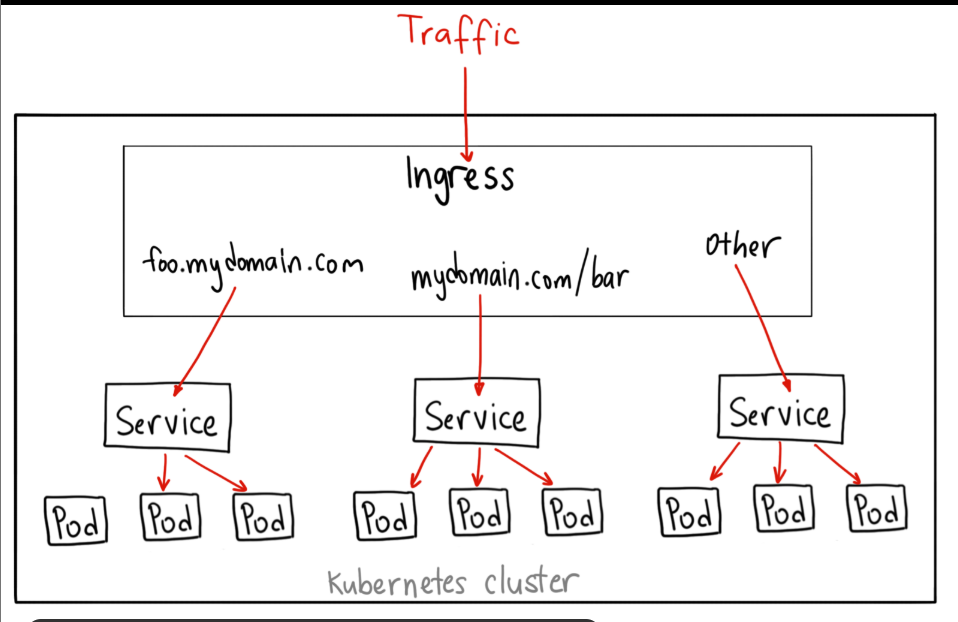

Containers vs. Virtual Machines
Understanding the differences between Docker containers and virtual machines (VMs) is crucial. Here's a brief comparison:

In a Docker-based architecture, the flow is:
Hardware → Operating System → Docker → Containers (with their own libraries and dependencies)
In a VM setup, the flow is:
Hardware → Host Operating System → Hypervisor (e.g., ESXi) → Virtual Machines (each with its own guest OS, libraries, and applications)

Docker containers are lightweight (typically measured in megabytes) and boot in seconds. In contrast, VMs require more disk space (often in gigabytes) and take minutes to boot since each VM runs a complete operating system. While Docker containers provide less isolation—by sharing the host kernel—VMs offer complete isolation with separate OS instances.

An image is a template, similar to a VM template, used to create one or more containers. Containers are the running instances of these images, each operating as an isolated environment with its own processes.

Key components of docker are: Docker engine, Docker CLI, Dockerfile, Docker Image, Docker Container, Docker Hub.

Docker requires daemon (a  persistent background service (a type of computer program that runs continuously without direct user interaction that acts as the central brain of the Docker platform. It manages all Docker objects, such as images, containers, networks, and volumes, on the host machine.))

History of Containers

Docker (container runtime) was the leading container tool.Kubernetes was initially designed to orchestrate Docker containers, creating a tight coupling between the two. Kubernetes introduced the Container Runtime Interface (CRI), to integrate any container runtime easily. It has two key standards:

image spec = Outlines how container images should be built.
Runtime Spec: Establishes the guidelines for developing a container runtime.

Docker has runtime component called runc which is responsible for all internal activities of docker and is managed by daemon called containerd. As Instead of users or higher-level systems interacting directly with the complex, low-level runc, they interact with Containerd. Containerd handles critical tasks such as:

Image Management: Pushing and pulling container images from registries (e.g., Docker Hub).
Container Lifecycle Management: Creating, starting, stopping, pausing, and deleting containers.
Integration: Providing an API for higher-level orchestrators, most famously Kubernetes, to manage containers effectively. 

Containerd originated as a component of Docker but has evolved into an independent project under the Cloud Native Computing Foundation with graduated status. It can be installed as a standalone runtime, making it a preferred alternative for users who do not need Docker’s complete set of features.

When using Containerd, you have access to the CTR tool—a CLI primarily focused on debugging rather than everyday container management.

To enhance the user experience, the nerdctl CLI provides Docker-like commands.

crictl: A Kubernetes-maintained debugging and inspection tool for any CRI-compatible runtime.

Podman is another example like docker. A daemonless, Docker-compatible alternative. The security is high.

Security difference between Podman and Docker: Docker uses a central daemon (dockerd).Daemon runs as root. All containers are controlled by this root daemon. If attacker compromises dockerdaemon or a privileged container then they can gain root access to the host system. If someone gets Docker socket access (/var/run/docker.sock),they basically get root on the server.
Podman has no daemon. Containers are run directly by the user. Supports rootless containers by default. No always-running root daemon. Each container is a child process of the user. If container is compromised:
Attacker is still limited to that user. No root escalation.

Container orchestration platforms provide the necessary resources and capabilities by managing container connectivity and autoscaling seamlessly.Container orchestration automates the deployment, scaling, and management of containerized applications. It does auto scaling, Self-healing (restart failed containers), Load balancing, Rolling updates & rollbacks, Infrastructure abstraction.

Kubernetes is a distributed system which work through multiple components.

Kubernetes stands out as the industry favorite. Although its initial setup might be more involved, Kubernetes offers extensive customization for deployments and can manage intricate architectures with ease. It is supported by all major public cloud providers—Google Cloud Platform, Azure, and AWS.

Kubernetes Architecture

A node is a physical or virtual machine where Kubernetes is installed. Acting as a worker in your cluster, nodes run your containerized applications.To ensure high availability, it is important to have multiple nodes grouped into a cluster. In a clustered environment, if one node fails, the application can continue running on other nodes while the workload is distributed evenly.
Worker node wo machine hoti hai jahan actual application containers run hote hain.

Managing a cluster requires a central control point, which is where the master node comes into play. The master node hosts components that control and monitor the cluster’s state. Components of control plane are API Server (Entry point for all commands), etcd (Key-value store (cluster state)), Scheduler (Assigns pods to nodes), Controller Manager(Maintains desired state).

Node (worker nodes) components are kubelet (Communicates with control plane), kube-proxy (Networking & service routing), Container runtime (Runs containers (Docker/CRI-O)).

several components of kubernetes:

API Server: The front end for Kubernetes. All requests (kubectl, UI, REST APIs) firstly come here. It checks request is valid or not. User is authorized or not. API Server is the only component that talks directly to etcd.

etcd Key-Value Store: A distributed, reliable store for all cluster data.It stores entire state of clusters like pods, nodes, configMaps, Secrets.etcd ensures that cluster configuration is synchronized across all the nodes. It also implements locking mechanisms to avoid conflicts between multiple masters. If etcd gets down, whole cluster can be unstable.

kubelet: An agent that runs on each node, ensuring containers are running as expected. It takes pod specifications from API Server. Containers ko run karwana. Jo pod define hua hai, wahi actually node par chal raha ho. 

Container Runtime: Software such as Docker that runs the containers.
Kubernetes directly Docker se baat nahi karta, wo CRI (Container Runtime Interface) ke through baat karta hai

Controllers basically "Watchers" hote hain jo cluster ki current state ko monitor karte hain aur check karte hain ki sab kuch user (admin) ke desired state (jo hum chahte hain) jaisa hai ya nahi, agar difference ho to woh automatic changes karte hain, taaki system hamesha sahi condition mein rahe.

Scheduler:The scheduler is responsible for detecting newly created container requests and assigning them to the most suitable nodes based on available resources and defined policies. It is decision based work: CPU and memory available, Node affinity, Policies and Constraints. Scheduler sirf decide karta hai, run nahi karta

The master node (control plane) runs critical components such as the kube-apiserver, control manager, scheduler, and the etcd key-value store. In contrast, worker nodes host the kubelet agent and the container runtime.
Master node application run nahi karta, sirf manage karta hai.

Kubernetes Request Flow

Step 1: kubectl (user request) -> user gives command. 
(kubectl apply -f pod.yaml) -> create one pod.

Step 2: this kubectl request goes to API Server. API Server validate the request. It also checks authentication and authorization of user.

Step 3: Valid request data store in etcd. then desired state get save in etcd. Currently pod is in pending state.

Step 4: Then Scheduler checks that pod is unscheduled. It then selects best worker node in which pod will gonna run. Whatever decision it has taken , it sends to API Server. It only chooses node. It doesn't run pod.

Step 5: Kubelet then takes pod specifications of selected worker node. And it tells container runtime to start the container. Actually, pod starts here to run.

Step 6: Controller continuously check that is pod crashed? are replicas sufficient? It resolves these issues automatically if requires. That's why we say that k8s is self healing.

Kubernetes objects -> They are resources which we are going to create inside cluster so that our application can run.

1) Pod -> Pod Kubernetes ka smallest deployable unit hota hai.Ek pod me 
1 ya multiple containers ho sakte hain.
Containers:
Same IP address
Same port space
Same storage (volumes) share karte hain

Containers ko directly run nahi kiya jata. Kubernetes hamesha pod ke through container run karta hai. Pod short-lived hota hai. Delete ho gaya → new IP milegi.

Real examples like: Single container pod → normal web app, Multi-container pod → sidecar pattern (logging, monitoring).

2) ReplicaSet (Availability Manager) -> ReplicaSet ensure karta hai ki fixed number of pods hamesha running rahein. It continuously checks - is pod deleted? node got down? if yes, then it automatically creates new pod. Advantages: High availability, Fault tolerance, Auto-recovery.

3) Deployment -> It is higher level object. It manages replicasets. It controls lifecycle of pods. Advantages: Pods create/delete, Rolling updates, Rollbacks, Version control. 

Note: Replicaset partially does creation/deletion pods as while maintaining replicas of pods. It manages only same version of pods. It doesn't have concept of rolling updates. It doesn't maintain history of previous state.

4) Namespace -> It is kind of logical seperation inside cluster. It helps in isolating resources inside cluster. example - Dev team → dev namespace, QA team → test namespace, Production → prod namespace.

Overall, 
User creates Deployment
Deployment creates ReplicaSet
ReplicaSet creates Pods
Pods run containers

Introduction to kubeadm & Minikube

kubeadm -> kubeadm ek official Kubernetes tool hai jo Production-grade Kubernetes cluster initialize karta hai. Control Plane + Worker Nodes ko setup karta hai. kubeadm = “Cluster banana” and Kubernetes = “Cluster chalana”. Control Plane components install karta hai: API Server, Scheduler, Controller Manager, etcd. Worker nodes ko cluster me join karwata hai. It is multi node.

Commands: 
kubeadm init
kubeadm join <master-ip>:6443 --token xyz

kubeadm kab use hota hai:
On-premise data centers
Bare metal servers
Cloud VMs (EC2, GCE)
Jab full control chahiye

kubeadm limitations:
Networking manually configure karni padti hai
Load balancer khud manage karna hota hai
Maintenance responsibility aapki hoti hai

It is used as production tool not learning tool.

Minikube -> It is tool which runs kubernetes cluster on local machine. It is mostly used for learning and testing purposes. it is single node cluster. (control plane and worker nodes on same machine). It works inside virtual machine or docker container. 

Command:
minikube start --driver=docker

Installation 

Minikube is the easiest way to launch a local Kubernetes cluster.Minikube packages the complete Kubernetes bundle into an ISO image that is automatically downloaded and deployed using its command-line utility. It integrates seamlessly with various virtualization platforms.To interact with your Kubernetes cluster, you also need to install the kubectl command-line tool.Hypervisor should be installed first before minikube.

Hypervisor - A virtualization tool such as VirtualBox, Hyper-V, or KVM.
kubectl - The official Kubernetes command-line tool.
Minikube executable - The utility that automates ISO download and cluster deployment.

Kubernetes resource definition files follow a consistent structure and always include four top-level fields:

apiVersion - shows kubernetes API version.
kind - type of kubernetes object to be created.
metadata - you provide key information about the Kubernetes object.
spec - describes the desired state of the object.

