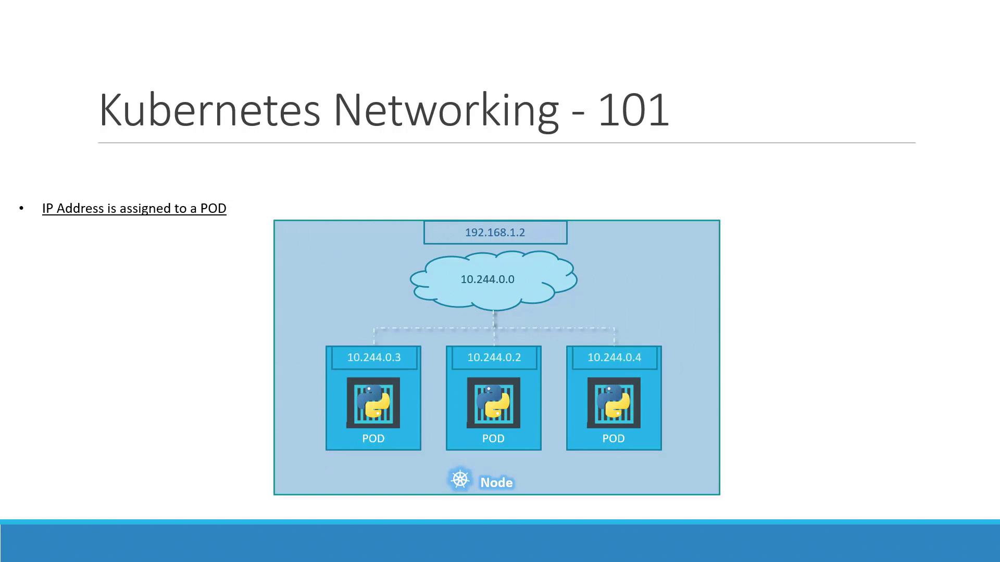
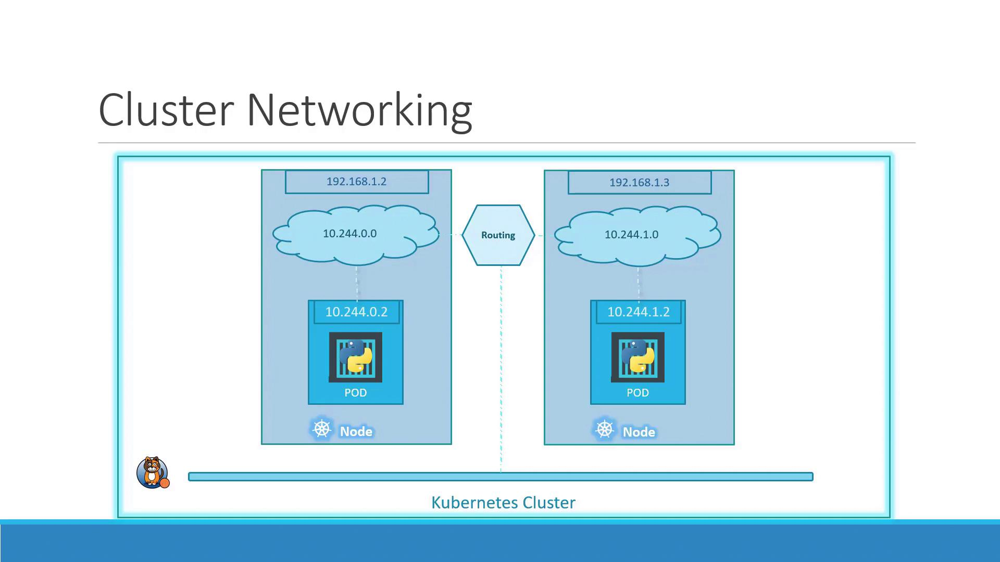

In a single-node Kubernetes cluster, the node might have an IP address such as 192.168.1.2. This IP address is used to access the node (for example, via SSH) through our own device.

within node cluster -> pods deployed -> each pod has own ip in range 10.244.0.0/16 -> enables pod-to-pod communication

note: ip addresses of pods can be change if pod get deleted and re created.

now, in multi-node setup, we have two nodes with different ip.

pod on each nodes define with ip address of range 10.244.0.0/16 -> result in overlapping / same ip address across the nodes.

note: same ip address of pod on different node can create conflict.

to remove conflict , we use external network solutions.When a solution such as Flannel or Calico is deployed, it allocates a unique network segment for each node. This approach assigns distinct IP addresses to every pod and node.

