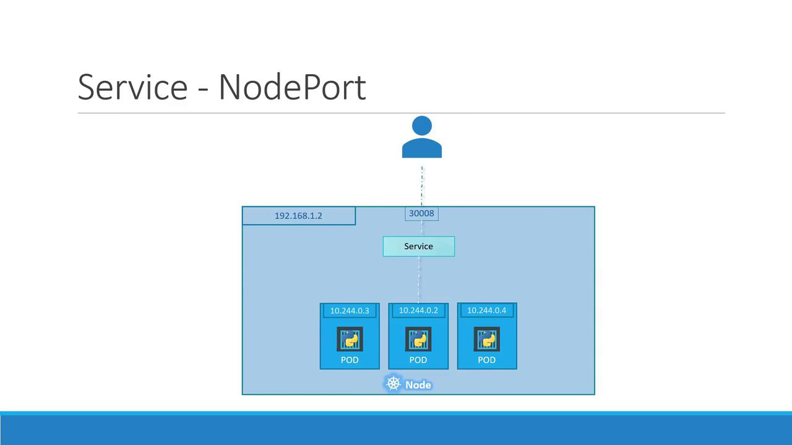
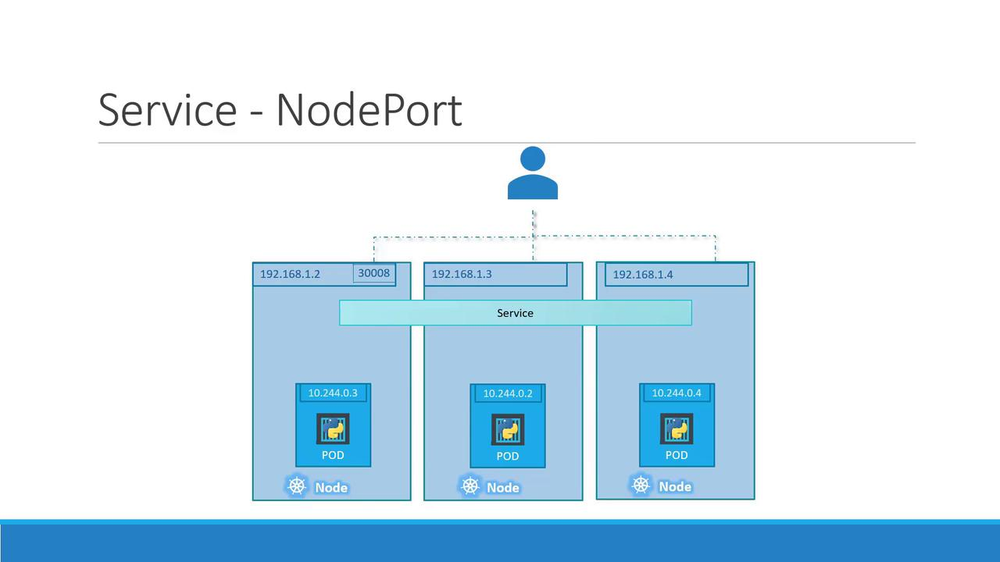
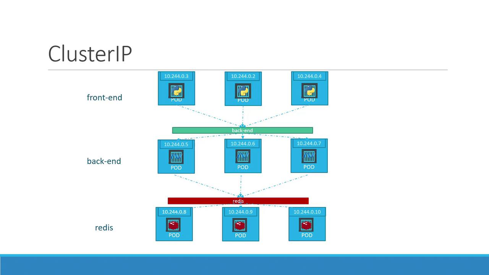
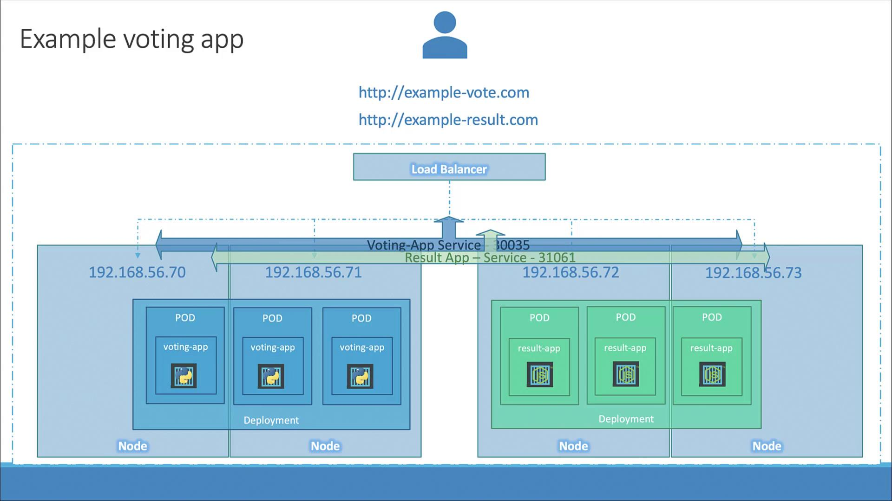

Kubernetes Services facilitate interaction among different parts of an application.

For instance, an application might include separate groups of Pods for front-end user interactions, back-end processing, and external data connections. With Services abstracting the intricacies of Pod networking, these groups communicate without the need to hard-code Pod IP addresses.

External Communication - Suppose node has some ip address. And laptop also use same network's range ip address. But pod's ip address belongs to different network range, making it directly inaccessible from the laptop.

If you SSH into the Kubernetes node using its IP (192.168.1.2), you can fetch the web page hosted by the Pod with:

curl http://10.244.0.2
Hello World!

But we want to access the application which is running inside pod directly from laptop. To do this we use  Kubernetes Service NodePort.

NodePort provides specific port on each node and forwards incoming external traffic or requests to a designated port on the Pod. We can say it maps port on node to pod's target port.

A NodePort Service involves three key ports:

Target Port: The port on the Pod where the web server is running (e.g., 80).
Service Port: A port on the Service object itself. Within the cluster, the Service also has a ClusterIP.
Node Port: An externally exposed port on each node. This must be within the range 30000–32767 (in our example, 30008).

It also does load balancing.When Pods share the same labels, Kubernetes automatically registers all matching Pods as endpoints for the Service.if there are three Pods with the label app: myapp, the NodePort Service will distribute incoming requests among all three.This ensures that you can use any node IP with the designated NodePort (in our case, 30008) to access your application without any disruption.

second service which we need is ClusterIP.
Consider the scenario: the front-end server needs to communicate with multiple back-end pods. Each pod receives an IP address, but these addresses can change as pods are terminated and recreated. Thus, it’s impractical to rely on pod IPs for internal communication. Additionally, if a request comes from the front-end (for example, from IP 10.244.0.3), it must be intelligently routed to one of the several available back-end pods.

we solve this problem by grouping related pods and exposing a single, stable interface.When you create a service for the back-end pods, Kubernetes aggregates them and provides a unified endpoint. Incoming requests are automatically load balanced across the available pods, ensuring efficient resource utilization and high availability. 

third service is load balancer.e, if your cluster consists of four nodes, a NodePort service listens on a fixed port on each node and forwards incoming traffic to the appropriate Pods. Although this method technically enables access via multiple URLs (each node’s IP combined with the NodePort), end users usually prefer a single, user-friendly URL.

to solve this challenge, we deploy an external load balancer on a dedicated VM using tools such as HAProxy or Nginx.These load balancers can be configured to route incoming traffic to the correct nodes based on the URL.

Endpoints - represent the pods that the service directs traffic to.

eg - Endpoints: 10.53.180.9:6443

if a service targets three pods (all matching the label selector), then three endpoints will be listed.If additional pods inadvertently match the service selector, the endpoints list will expand, potentially impacting traffic routing.If the service's selector does not match any pod labels, the endpoints list will be empty.

